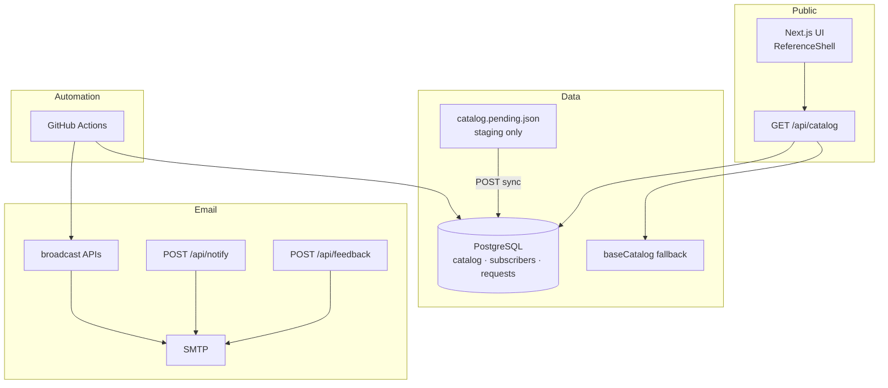
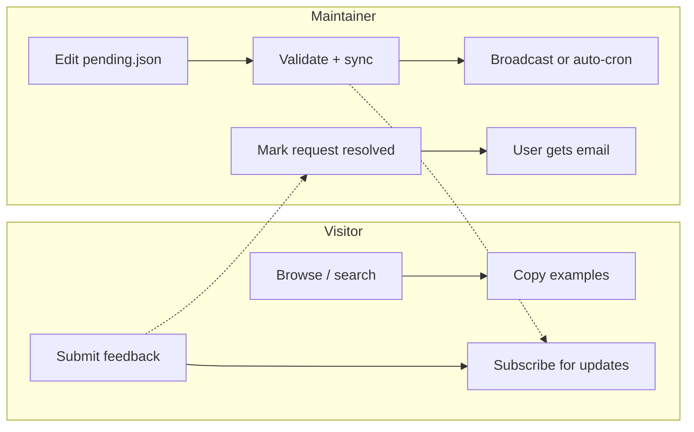

# AI Dev Reference

> Searchable commands, skills, agents, and hooks for **Claude**, **Cursor**, and **GitHub Copilot** — with purpose and copy-paste examples for every entry.

[](https://github.com/nuthan-murarysetty/ai-dev-ref/actions/workflows/auto-broadcast-feed-updates.yml)
[](https://github.com/nuthan-murarysetty/ai-dev-ref/actions/workflows/broadcast-release.yml)
[](https://nextjs.org/)
[](https://www.typescriptlang.org/)
[](LICENSE)

**Community-maintained reference. Not affiliated with Anthropic, Cursor, or Microsoft.**

---

## What this site does

| Capability | Description |
|------------|-------------|
| **Browse** | Commands, skills, agents, and hooks per tool |
| **Search** | Global search across names, descriptions, and triggers |
| **Compare** | Side-by-side tool comparison on the landing page |
| **Copy examples** | Every card includes a copy-paste usage example |
| **Subscribe** | Email alerts when new catalog entries are published |
| **What's new** | `/whats-new` shows recently added entries |
| **Feedback** | Submit requests; admin can mark resolved and notify by email |

---

## Architecture (overview)



**Catalog read priority:** PostgreSQL snapshot → in-code `baseCatalog` if DB is down.  
**Pending file** is never served to visitors — it is a draft queue before sync.

---

## Documentation map

Detailed flows with diagrams live in **[docs/](docs/README.md)** — use this table instead of scrolling one long README.

### Start here

| Topic | Guide |
|-------|-------|
| **All docs index** | [docs/README.md](docs/README.md) |
| **System architecture** | [docs/flows/01-architecture.md](docs/flows/01-architecture.md) |
| **Site & catalog read** | [docs/flows/02-site-and-catalog-read.md](docs/flows/02-site-and-catalog-read.md) |

### Catalog (maintainers)

| Topic | Guide |
|-------|-------|
| Add new commands (incremental) | [docs/flows/03-catalog-update.md](docs/flows/03-catalog-update.md) |
| First deploy & seed | [docs/flows/04-catalog-first-deploy.md](docs/flows/04-catalog-first-deploy.md) |
| Local dev without DB | [docs/flows/05-catalog-local-dev.md](docs/flows/05-catalog-local-dev.md) |
| Full catalog runbook | [docs/CATALOG_SETUP_GUIDE.md](docs/CATALOG_SETUP_GUIDE.md) |

### Email & subscribers

| Topic | Guide |
|-------|-------|
| Feedback submit & resolve | [docs/flows/06-feedback-and-resolve.md](docs/flows/06-feedback-and-resolve.md) |
| Notify signup & confirm | [docs/flows/07-subscriber-notify.md](docs/flows/07-subscriber-notify.md) |
| Release broadcast & auto-cron | [docs/flows/08-release-broadcast.md](docs/flows/08-release-broadcast.md) |

### Operations

| Topic | Guide |
|-------|-------|
| CI/CD & GitHub Actions | [docs/flows/09-ci-cd.md](docs/flows/09-ci-cd.md) |
| Environment variables & keys | [docs/flows/10-environment-and-keys.md](docs/flows/10-environment-and-keys.md) |
| Operator handbook (API, JSON shapes) | [docs/OPERATIONS.md](docs/OPERATIONS.md) |
| UX / user testing | [docs/USER_TESTING.md](docs/USER_TESTING.md) |

---

## High-level flows



| I want to… | Read |
|------------|------|
| Browse the live site | [Site & catalog read](docs/flows/02-site-and-catalog-read.md) |
| Add new slash commands | [Catalog update](docs/flows/03-catalog-update.md) |
| Deploy for the first time | [First deploy & seed](docs/flows/04-catalog-first-deploy.md) |
| Resolve a user request | [Feedback & resolve](docs/flows/06-feedback-and-resolve.md) |
| Fix auto-broadcast 401 | [Release broadcast](docs/flows/08-release-broadcast.md) |
| Set up GitHub secrets | [CI/CD](docs/flows/09-ci-cd.md) + [Environment & keys](docs/flows/10-environment-and-keys.md) |

---

## Quick start

```bash
git clone https://github.com/nuthan-murarysetty/ai-dev-ref.git
cd ai-dev-ref
npm install
cp .env.example .env.local
npm run dev
```

Open [http://localhost:3000](http://localhost:3000). Catalog loads from `baseCatalog` without a database.

Production setup: [First deploy & seed](docs/flows/04-catalog-first-deploy.md).

---

## npm scripts

| Command | Guide |
|---------|-------|
| `npm run dev` | [Local dev](docs/flows/05-catalog-local-dev.md) |
| `npm run catalog:validate` | [Catalog update](docs/flows/03-catalog-update.md) |
| `npm run catalog:seed-db` | [First deploy](docs/flows/04-catalog-first-deploy.md) |
| `npm run catalog:merge` | [Local dev](docs/flows/05-catalog-local-dev.md) |
| `npm run catalog:reset-pending` | [Catalog update](docs/flows/03-catalog-update.md) |

---

## Contributing

- **Branch naming:** use `feature/<descriptive-name>` for all PR branches (not `cursor/`).
- **Missing a command?** Use the [feedback form](https://www.aidevreference.com/feedback) or open an issue.
- **Add catalog data?** PR with `data/catalog.pending.json` — see [Catalog update flow](docs/flows/03-catalog-update.md).
- **Security reports:** see [SECURITY.md](SECURITY.md) · [16-test live audit](docs/SECURITY_LIVE_TESTS.md) · [verification guide](docs/SECURITY_VERIFICATION.md).
- **Operators:** Start at [docs/README.md](docs/README.md).

### Official vendor docs

- [Claude Code](https://code.claude.com/docs) · [Cursor](https://cursor.com/docs) · [GitHub Copilot](https://code.visualstudio.com/docs/copilot)

---

## Disclaimer

Unofficial, community-maintained reference. Command names and behavior may change when vendors update their tools. Confirm against official documentation before production use.

---

## License

[MIT](LICENSE) — Copyright (c) 2026 Nuthan Murarysetty
