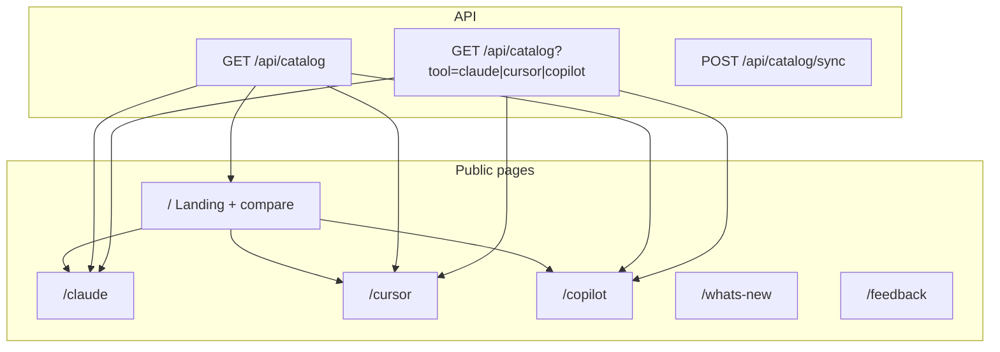
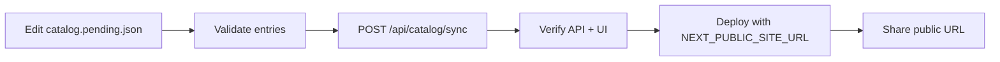
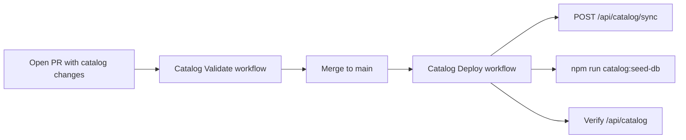
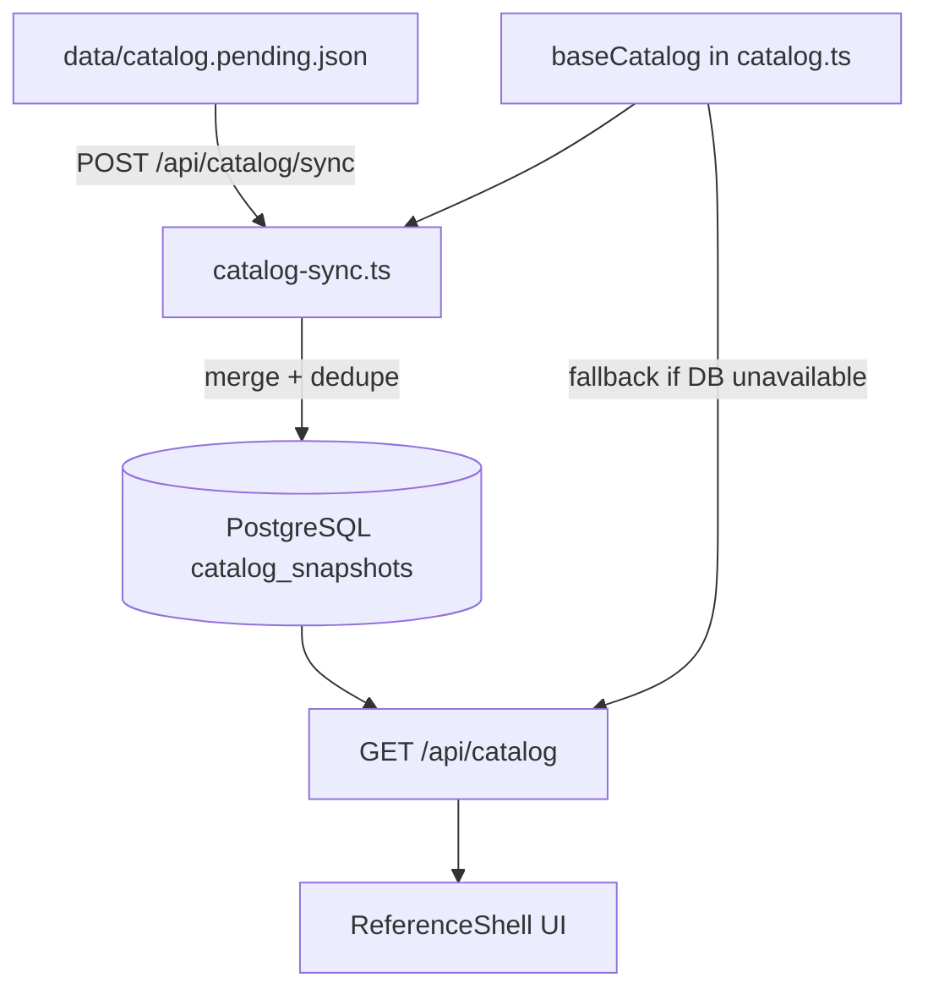

# AI Dev Reference

> Searchable commands, skills, agents, and hooks for **Claude**, **Cursor**, and **GitHub Copilot** — with purpose and copy-paste examples for every entry.

[](https://github.com/nuthan-murarysetty/ai-dev-ref/actions/workflows/auto-broadcast-feed-updates.yml)
[](https://github.com/nuthan-murarysetty/ai-dev-ref/actions/workflows/broadcast-release.yml)
[](https://nextjs.org/)
[](https://www.typescriptlang.org/)
[](LICENSE)

**Community-maintained reference. Not affiliated with Anthropic, Cursor, or Microsoft.**

---

## What this site does

Developers switch between Claude Code, Cursor, and Copilot — but slash commands, skills, hooks, and subagents are scattered across different docs. **AI Dev Reference** puts them in one searchable place:

| Capability | Description |
|------------|-------------|
| **Browse** | Commands, skills, agents, and hooks per tool |
| **Search** | Global search across names, descriptions, and triggers |
| **Compare** | Side-by-side tool comparison on the landing page |
| **Copy examples** | Every card includes a copy-paste usage example |
| **Subscribe** | Email alerts when new catalog entries are published |
| **What's new** | `/whats-new` shows recently added entries |

### Current catalog size

| Tool | Commands | Skills | Agents | Hooks | Total |
|------|----------|--------|--------|-------|-------|
| Claude | 29 | 8 | 3 | 6 | **46** |
| Cursor | 11 | 9 | 4 | 6 | **30** |
| Copilot | 15 | 4 | 4 | 3 | **26** |
| **All** | **55** | **21** | **11** | **15** | **102** |

---

## Site map



| Route | What you see |
|-------|--------------|
| `/` | Tool cards, live entry counts, **comparison table** |
| `/claude` | Claude commands grouped by category + skills, agents, hooks |
| `/cursor` | Cursor commands, skills, agents, hooks |
| `/copilot` | Copilot chat commands, workspace agents, skills, hooks |
| `/whats-new` | Recently added catalog entries |
| `/feedback` | Report missing commands or request additions |
| `/api/catalog` | Public JSON API (cached, no auth) |

---

## Catalog update workflow

Use this flow whenever you add or refresh catalog data:



### Automated workflow (GitHub Actions)

You can automate validation and deployment — no manual `seed-db` or `curl sync` needed after setup.



| Workflow | Trigger | What it does |
|----------|---------|--------------|
| **Catalog Validate** | Every PR that touches catalog files | JSON syntax check + duplicate detection |
| **Catalog Deploy** | Push to `main` or manual dispatch | Sync API + seed DB + verify live API |
| **Auto Broadcast** | Every 6 hours | Email subscribers about new entries |

#### One-time GitHub secrets setup

In **GitHub → Settings → Secrets and variables → Actions**, add:

| Secret | Example value |
|--------|---------------|
| `DATABASE_URL` | Your Neon PostgreSQL connection string |
| `SYNC_ENDPOINT_URL` | `https://aidevreference.vercel.app/api/catalog/sync` |
| `ADMIN_BROADCAST_KEY` | Same key as in Vercel env vars |
| `SITE_URL` | `https://aidevreference.vercel.app` |

After secrets are set, every merge to `main` that changes `catalog.pending.json` or `src/lib/catalog.ts` automatically updates production.

**Manual trigger:** GitHub → Actions → **Catalog Deploy** → Run workflow → choose `auto`, `sync`, or `seed`.

### Step-by-step

#### 1. Edit `data/catalog.pending.json`

Add new commands, skills, agents, or hooks under the correct tool (`claude`, `cursor`, `copilot`).

```bash
# Quick JSON syntax check
node -e "JSON.parse(require('fs').readFileSync('data/catalog.pending.json','utf8')); console.log('JSON OK')"
```

See [docs/OPERATIONS.md](docs/OPERATIONS.md) for entry shapes and examples.

#### 2. Validate entries

```bash
npm run catalog:validate
```

Checks required fields, reports duplicates, and shows how many entries would be inserted. Expect:

- `Validation warnings: 0`
- `Duplicates found: 0`

#### 3. Merge locally (optional, for dev without DB)

```bash
npm run catalog:merge
```

Merges pending into `baseCatalog` in `src/lib/catalog.ts` so the site works locally without PostgreSQL.

#### 4. Sync to database

**Option A — API sync** (production workflow):

```bash
curl -X POST "http://localhost:3000/api/catalog/sync" \
  -H "x-admin-key: $ADMIN_BROADCAST_KEY"
```

**Option B — Direct DB seed** (first deploy when data is already in baseCatalog):

```bash
npm run catalog:seed-db
```

#### 5. Verify API + UI

```bash
npm run dev

# Full catalog
curl http://localhost:3000/api/catalog

# One tool
curl "http://localhost:3000/api/catalog?tool=claude"
```

Open `/claude`, `/cursor`, `/copilot` and confirm cards appear.

#### 6. Deploy and share

Set in Vercel (or `.env.local`):

| Variable | Example |
|----------|---------|
| `DATABASE_URL` | `postgresql://...` (run `db/subscribers.sql` first) |
| `NEXT_PUBLIC_SITE_URL` | `https://your-domain.vercel.app` |
| `ADMIN_BROADCAST_KEY` | `openssl rand -base64 48` |

```bash
npm run build   # verify before deploy
```

Share:

- `https://your-domain.vercel.app` — main site
- `https://your-domain.vercel.app/api/catalog` — public JSON API

> **Full runbook with exact commands used:** [docs/CATALOG_SETUP_GUIDE.md](docs/CATALOG_SETUP_GUIDE.md)

---

## Architecture



**Data priority:**

1. PostgreSQL snapshot (`catalog_snapshots`, row `id=active`) — **live site reads this**
2. In-code fallback (`baseCatalog` in `src/lib/catalog.ts`) — only if DB is unavailable

`catalog.pending.json` is **not** read by the site. It is a staging draft for new entries before sync.

After seeding, reset pending so the repo stays clean:

```bash
npm run catalog:reset-pending   # or included automatically in catalog:seed-db
```

**Dedup keys** (duplicates are silently skipped on sync):

| Type | Key |
|------|-----|
| Commands | `cmd\|name` |
| Skills / Hooks | `cmd\|name` |
| Agents | `name` |

---

## Why the landing page shows a comparison table

The table at the bottom of `/` is **intentional** — it is a **side-by-side tool comparison**, not a git diff or error.

| Row | What it shows |
|-----|---------------|
| Built-in commands count | Live counts from the catalog (e.g. Claude 29, Cursor 11, Copilot 15) |
| Bundled skills/agents | How each tool packages reusable workflows |
| Parallel execution | Whether the tool supports parallel agent/task flows |
| Context management | How each tool handles project memory and context |
| MCP support | Model Context Protocol availability |
| Memory/rules file | Where persistent instructions live per tool |
| Code review | Review workflows per tool |
| Surfaces | Where you use each tool (terminal, IDE, chat) |

Command counts differ because each vendor documents a different number of slash commands. That is expected and reflects real product differences.

---

## Quick start (local development)

```bash
git clone https://github.com/nuthan-murarysetty/ai-dev-ref.git
cd ai-dev-ref
npm install
cp .env.example .env.local
# Fill in DATABASE_URL, SMTP, Turnstile, and admin keys (optional for local catalog browsing)
npm run dev
```

Open [http://localhost:3000](http://localhost:3000).

The catalog loads from `baseCatalog` even without a database configured.

---

## npm scripts

| Command | Purpose |
|---------|---------|
| `npm run dev` | Start local dev server |
| `npm run build` | Production build |
| `npm run catalog:validate` | Validate pending JSON, check duplicates |
| `npm run catalog:merge` | Merge pending into baseCatalog |
| `npm run catalog:seed-db` | Write baseCatalog to PostgreSQL + reset pending |
| `npm run catalog:reset-pending` | Clear `catalog.pending.json` staging file |

---

## Project structure

```
src/
  app/              # Routes and API endpoints
  features/         # ReferenceShell UI and forms
  lib/              # Catalog, subscribers, mail, validation
data/
  catalog.pending.json   # Staging queue for new catalog entries
scripts/
  merge-catalog.ts       # Validate + merge + dedupe
  seed-catalog-db.ts     # Seed PostgreSQL from baseCatalog
db/
  subscribers.sql        # PostgreSQL schema bootstrap
docs/
  OPERATIONS.md          # Maintainer handbook (sync, broadcast, deploy)
  CATALOG_SETUP_GUIDE.md # Step-by-step catalog population runbook
```

---

## Environment variables

See [.env.example](.env.example) for the full template.

| Variable | Required for | Purpose |
|----------|--------------|---------|
| `DATABASE_URL` | Production sync | PostgreSQL catalog + subscribers |
| `NEXT_PUBLIC_SITE_URL` | Production | SEO, sitemap, email links |
| `ADMIN_BROADCAST_KEY` | Catalog sync | Auth for `POST /api/catalog/sync` |
| `CRON_BROADCAST_KEY` | Auto-broadcast | GitHub Actions cron |
| `SMTP_*`, `MAIL_*` | Email features | Feedback + subscriber notifications |
| `TURNSTILE_*` | Forms | Anti-abuse on feedback/subscribe |

Generate secure keys:

```bash
openssl rand -base64 48
```

---

## API endpoints

| Method | Endpoint | Auth | Purpose |
|--------|----------|------|---------|
| `GET` | `/api/catalog` | None | Full catalog JSON |
| `GET` | `/api/catalog?tool=claude` | None | Single tool catalog |
| `POST` | `/api/catalog/sync` | `x-admin-key` | Merge pending → DB |
| `POST` | `/api/feedback` | Turnstile | User feedback |
| `POST` | `/api/notify` | Turnstile | Subscribe for updates |

---

## Contributing

- **Missing a command?** Use the [feedback form](/feedback) on the live site or open an issue.
- **Want to add catalog data?** Open a PR with entries in `data/catalog.pending.json` following [docs/OPERATIONS.md](docs/OPERATIONS.md).
- **Operator runbook:** [docs/CATALOG_SETUP_GUIDE.md](docs/CATALOG_SETUP_GUIDE.md)

---

## Official documentation

Always verify against vendor docs before production use:

- [Claude Code docs](https://code.claude.com/docs)
- [Cursor docs](https://cursor.com/docs)
- [GitHub Copilot docs](https://code.visualstudio.com/docs/copilot)

---

## Disclaimer

This is an **unofficial, community-maintained** reference. Command names, behavior, and availability may change when vendors update their tools. We do our best to keep the catalog current, but always confirm against official documentation.

---

## License

[MIT](LICENSE) — Copyright (c) 2026 Nuthan Murarysetty
