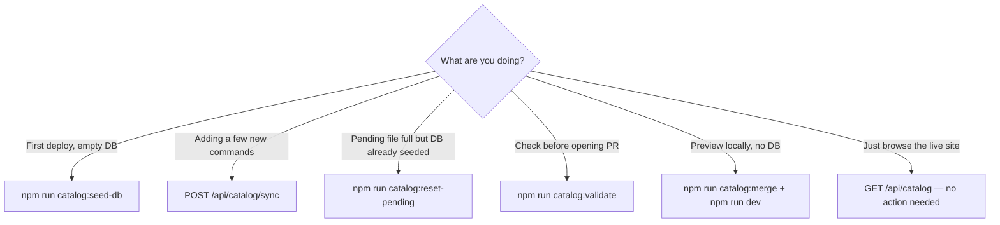
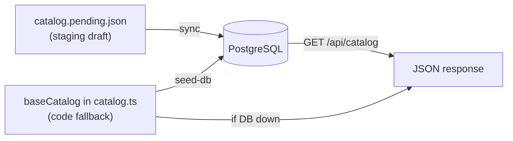

# Catalog Setup Guide — Step-by-Step Runbook

Operator guide for populating, validating, seeding, and deploying the AI Dev Reference catalog.

> **Visual flow guides:** [docs/README.md](README.md) — [incremental update](flows/03-catalog-update.md) · [first deploy](flows/04-catalog-first-deploy.md) · [local dev](flows/05-catalog-local-dev.md)

---

## Quick decision guide — which action when?



| Situation | Run this | Do NOT run |
|-----------|----------|------------|
| **First production deploy** | `catalog:seed-db` | `sync` (pending may be empty) |
| **Add 1–10 new commands** | Edit pending → `catalog:validate` → `POST sync` | `seed-db` (overwrites whole snapshot) |
| **Pending.json still full after seed** | `catalog:reset-pending` | Nothing is broken — just reset the draft |
| **Open a catalog PR** | `catalog:validate` | `seed-db` on every PR |
| **Local preview, no PostgreSQL** | `catalog:merge` + `npm run dev` | `seed-db` |
| **Check if production uses DB** | `curl .../api/catalog` → check `sourceFeeds` | Opening `/sync` in browser |
| **Re-deploy after code change** | GitHub **Catalog Deploy** or `catalog:seed-db` | Manual pending edits |

---

## Scripts reference

| npm command | Script file | When to run | Reads pending? | Writes DB? | Clears pending? |
|-------------|-------------|-------------|----------------|------------|-----------------|
| `catalog:validate` | `scripts/merge-catalog.ts` | Before every catalog PR | Yes | No | No |
| `catalog:merge` | `scripts/merge-catalog.ts --write` | Local dev without DB | Yes | No (writes code) | No |
| `catalog:seed-db` | `scripts/seed-catalog-db.ts` | First deploy, full refresh | No | **Yes** | **Yes** |
| `catalog:reset-pending` | `scripts/reset-pending.ts` | After seed, stale pending | No | No | **Yes** |
| `POST /api/catalog/sync` | API route | Incremental new entries | Yes | **Yes** | Yes, if inserts > 0 |

### Flags

| Flag | Command | When to use |
|------|---------|-------------|
| `--keep-pending` | `npm run catalog:seed-db -- --keep-pending` | Rare — keep pending file after seed |

### Environment

| Script | Needs `.env.local`? | Required variable |
|--------|---------------------|-------------------|
| `catalog:validate` | No | — |
| `catalog:merge` | No | — |
| `catalog:seed-db` | **Yes** | `DATABASE_URL` |
| `catalog:reset-pending` | No | — |
| `POST /api/catalog/sync` | On server | `ADMIN_BROADCAST_KEY` + `DATABASE_URL` |

---

## Three storage layers



| Layer | Location | Read by live site? | Purpose |
|-------|----------|-------------------|---------|
| **Pending** | `data/catalog.pending.json` | **No** | Draft queue for *new* entries only |
| **Base catalog** | `src/lib/catalog.ts` | Only if DB unavailable | Backup + seed source |
| **Database** | PostgreSQL `catalog_snapshots` | **Yes** (primary) | Live production catalog |

`/api/catalog` always returns JSON. Check `"sourceFeeds"`:

- `["database-snapshot"]` → data from PostgreSQL
- `["json-seed-cache"]` → fallback from code (DB not connected)

### Reset pending after seed

Once data is in `baseCatalog` and the database, clear the staging file:

```bash
npm run catalog:reset-pending
```

Or seed and reset in one step (default):

```bash
npm run catalog:seed-db
```

`catalog:seed-db` automatically resets `catalog.pending.json` unless you pass `--keep-pending`.

Commit the emptied `catalog.pending.json` so the repo matches production state.

---

## Scenario walkthroughs

### Scenario A — First-time setup (empty database)

**When:** Brand-new deploy. Catalog data is in `baseCatalog`. Database has no snapshot yet.

```bash
# 1. Once: run db/subscribers.sql in Neon
# 2. Set DATABASE_URL in .env.local
npm install
npm run catalog:seed-db        # → DB populated, pending cleared
npm run dev                    # → verify sourceFeeds: database-snapshot
# 3. Set DATABASE_URL on Vercel (same Neon URL), deploy
# 4. Share https://your-domain.vercel.app
```

### Scenario B — Add new commands (incremental)

**When:** Production is live. You have a few new entries to add.

```bash
# 1. Add ONLY new entries to data/catalog.pending.json
npm run catalog:validate
# 2. Open PR → Catalog Validate runs automatically
# 3. After merge, either:
#    - GitHub Catalog Deploy runs (if secrets set), OR
curl -X POST "https://aidevreference.vercel.app/api/catalog/sync" \
  -H "x-admin-key: YOUR_ADMIN_BROADCAST_KEY"
# 4. Pending cleared automatically if inserts > 0
```

### Scenario C — Pending full but DB already seeded

**When:** You used `catalog:seed-db` and `catalog.pending.json` still has 102 entries.

```bash
npm run catalog:reset-pending
git add data/catalog.pending.json
git commit -m "Reset catalog pending after seed"
```

### Scenario D — Local dev without database

**When:** You only want to preview UI changes.

```bash
npm run catalog:merge   # optional
npm run dev
```

---

## Overview of the 4 tasks

| # | Task | When | Outcome |
|---|------|------|---------|
| 1 | Gather data from official docs | Initial catalog build or major refresh | Documented entries per tool |
| 2 | Create `data/catalog.pending.json` | Before first merge or incremental adds | Staging queue for new entries |
| 3 | Validate, merge, check duplicates | Before every PR | 0 warnings, 0 duplicates |
| 4 | Verify API + UI + build | Before deploy | Site shows full catalog |

### Task 1 — Gather required information

**When:** Building or refreshing the catalog from official vendor documentation.

| Tool | Official documentation |
|------|------------------------|
| Claude | [code.claude.com/docs](https://code.claude.com/docs/en/commands) — commands, skills, subagents, hooks |
| Cursor | [cursor.com/docs](https://cursor.com/docs/skills) — skills, hooks, agent commands |
| Copilot | [GitHub Copilot cheat sheet](https://docs.github.com/en/copilot/reference/chat-cheat-sheet) + [VS Code Copilot features](https://code.visualstudio.com/docs/agents/reference/copilot-vscode-features) |

### Data collected per entry type

| Type | Required fields | Identity key (for dedup) |
|------|-----------------|--------------------------|
| Commands | `cmd`, `name`, `desc`, `ex` | `cmd\|name` |
| Skills | `cmd`, `name`, `auto`, `desc`, `ex`, `trigger` | `cmd\|name` |
| Agents | `name`, `badge`, `color`, `desc`, `tools`, `model`, `invoke`, `when` | `name` |
| Hooks | `cmd`, `name`, `auto`, `desc`, `ex`, `trigger` | `cmd\|name` |

### Final counts after merge

| Tool | Commands | Skills | Agents | Hooks | Total |
|------|----------|--------|--------|-------|-------|
| Claude | 29 | 8 | 3 | 6 | 46 |
| Cursor | 11 | 9 | 4 | 6 | 30 |
| Copilot | 15 | 4 | 4 | 3 | 26 |
| **All** | **55** | **21** | **11** | **15** | **102** |

---

## Task 2 — Create the JSON staging file

**When:** Adding new catalog entries (initial bulk load or incremental updates).

### File location

```
data/catalog.pending.json
```

### Validate JSON syntax

```bash
node -e "JSON.parse(require('fs').readFileSync('data/catalog.pending.json','utf8')); console.log('JSON OK')"
```

### Base shape

```json
{
  "tools": {
    "claude": { "groups": [], "skills": [], "agents": [], "hooks": [] },
    "cursor": { "groups": [], "skills": [], "agents": [], "hooks": [] },
    "copilot": { "groups": [], "skills": [], "agents": [], "hooks": [] }
  }
}
```

### Example: add a Claude command

```json
{
  "tools": {
    "claude": {
      "groups": [
        {
          "id": "core",
          "label": "Core Commands",
          "entries": [
            {
              "cmd": "/init",
              "name": "Initialize Project",
              "desc": "Generate a starter CLAUDE.md guide for the current repository.",
              "ex": "/init",
              "badge": "wf"
            }
          ]
        }
      ]
    }
  }
}
```

Full examples for skills, agents, and hooks are in [OPERATIONS.md](./OPERATIONS.md).

---

## Task 3 — Validate, merge, and check duplicates

**When:** Before opening a PR, or before running sync/seed to production.

### Scripts added

| Script | npm command | When to run |
|--------|-------------|-------------|
| `scripts/merge-catalog.ts` | `npm run catalog:validate` | Before every catalog PR |
| `scripts/merge-catalog.ts --write` | `npm run catalog:merge` | Local dev without DB |
| `scripts/seed-catalog-db.ts` | `npm run catalog:seed-db` | First deploy or full DB refresh |
| `scripts/reset-pending.ts` | `npm run catalog:reset-pending` | After seed, or stale pending file |

### Step 3a — Install dependencies

```bash
npm install
npm install -D tsx
```

### Step 3b — Run validation (no writes)

```bash
npm run catalog:validate
```

**Expected output:**

```
=== Catalog Merge Report ===

Inserted from pending:
  claude: 25 commands, 7 skills, 2 agents, 5 hooks
  cursor: 8 commands, 8 skills, 3 agents, 5 hooks
  copilot: 12 commands, 3 skills, 3 agents, 2 hooks

Final catalog totals:
  claude: 29 commands, 8 skills, 3 agents, 6 hooks (46 total)
  cursor: 11 commands, 9 skills, 4 agents, 6 hooks (30 total)
  copilot: 15 commands, 4 skills, 4 agents, 3 hooks (26 total)

Validation warnings: 0
Duplicates found: 0

Merge validation passed.
```

### Step 3c — Merge into baseCatalog

```bash
npm run catalog:merge
```

This updates `src/lib/catalog.ts` (`baseCatalog`) so the site works without a database.

### Step 3d — Sync to database (production)

Scripts load variables from `.env.local` automatically (same as `next dev`).

**Option A — API sync** (merges pending → DB, clears pending file):

```bash
curl -X POST "http://localhost:3000/api/catalog/sync" \
  -H "x-admin-key: $ADMIN_BROADCAST_KEY"
```

**Option B — Direct DB seed** (when pending is already merged into baseCatalog):

```bash
npm run catalog:seed-db
```

> **Note:** If all pending entries are already in `baseCatalog`, `POST /api/catalog/sync` returns `insertedTotal: 0` and does not write to the DB. Use `catalog:seed-db` for first-time production setup in that case.

---

## Task 4 — Verify API and UI

**When:** After seed or sync, and before every production deploy.

### Step 4a — Start dev server

```bash
npm run dev
```

Open [http://localhost:3000](http://localhost:3000).

### Step 4b — Verify full catalog API

```bash
curl -s "http://localhost:3000/api/catalog" | node -e "
const chunks = [];
process.stdin.on('data', d => chunks.push(d));
process.stdin.on('end', () => {
  const data = JSON.parse(Buffer.concat(chunks).toString());
  for (const t of ['claude','cursor','copilot']) {
    const c = data.tools[t];
    const cmds = c.groups.reduce((s,g) => s + g.entries.length, 0);
    console.log(t + ':', cmds, 'commands,', c.skills?.length||0, 'skills,',
      c.agents?.length||0, 'agents,', c.hooks?.length||0, 'hooks');
  }
  console.log('warnings:', data.diagnostics?.validationWarnings?.length ?? 0);
});
"
```

**Expected:**

```
claude: 29 commands, 8 skills, 3 agents, 6 hooks
cursor: 11 commands, 9 skills, 4 agents, 6 hooks
copilot: 15 commands, 4 skills, 4 agents, 3 hooks
warnings: 0
```

### Step 4c — Verify tool-scoped API

```bash
curl -s "http://localhost:3000/api/catalog?tool=claude" | head -c 200
```

### Step 4d — Verify UI pages

```bash
curl -s -o /dev/null -w "/=%{http_code} /claude=%{http_code} /cursor=%{http_code} /copilot=%{http_code}\n" \
  http://localhost:3000/ \
  http://localhost:3000/claude \
  http://localhost:3000/cursor \
  http://localhost:3000/copilot
```

**Expected:** all `200`.

### Step 4e — Production build

```bash
npm run build
```

---

## Deploy and share publicly

### Environment variables (`.env.local` / Vercel)

| Variable | Purpose |
|----------|---------|
| `DATABASE_URL` | PostgreSQL connection (Neon recommended) |
| `NEXT_PUBLIC_SITE_URL` | Public URL, no trailing slash |
| `ADMIN_BROADCAST_KEY` | Auth for `POST /api/catalog/sync` |
| `CRON_BROADCAST_KEY` | Auth for auto-broadcast cron |

Generate keys:

```bash
openssl rand -base64 48
```

### Database bootstrap

```bash
# Run db/subscribers.sql in your PostgreSQL instance
# Then seed the catalog:
npm run catalog:seed-db
```

### URLs to share

| URL | Purpose |
|-----|---------|
| `https://your-domain.vercel.app` | Landing page + tool comparison |
| `/claude`, `/cursor`, `/copilot` | Per-tool command browsers |
| `/api/catalog` | Public JSON API |
| `/whats-new` | Recently added entries |

---

## Why the landing page shows a comparison table

The table at the bottom of the homepage is **intentional**. It is a **side-by-side tool comparison**, not a git diff or error.

It is rendered in `src/features/reference/reference-shell.tsx` inside the `compare-wrap` section. The first row shows live command counts from the catalog:

- Claude: 29 commands
- Cursor: 11 commands
- Copilot: 15 commands

The counts differ because each vendor exposes a different number of documented slash commands. The remaining rows compare capabilities (skills/agents, MCP, memory files, code review, surfaces) across tools.

This is a feature of the site design — it helps users choose or compare tools at a glance.

---

## Quick command reference

```bash
# ── First deploy (empty DB) ──────────────────────────────
npm install
npm run catalog:seed-db           # DB + clear pending
npm run dev                       # verify locally

# ── Add new commands later ───────────────────────────────
# Edit data/catalog.pending.json
npm run catalog:validate
curl -X POST "$SITE_URL/api/catalog/sync" -H "x-admin-key: $ADMIN_BROADCAST_KEY"

# ── Pending stale but DB is live ───────────────────────
npm run catalog:reset-pending

# ── Local preview, no DB ───────────────────────────────
npm run catalog:merge && npm run dev

# ── Before deploy ──────────────────────────────────────
npm run catalog:validate
npm run build
```

---

## Files touched in this setup

| File | Role |
|------|------|
| `data/catalog.pending.json` | Staging queue for new entries |
| `src/lib/catalog.ts` | `baseCatalog` — in-code fallback + seed source |
| `scripts/merge-catalog.ts` | Validate, dedupe, merge |
| `scripts/seed-catalog-db.ts` | Write baseCatalog to PostgreSQL |
| `package.json` | `catalog:validate`, `catalog:merge`, `catalog:seed-db`, `catalog:reset-pending` scripts |
| `docs/OPERATIONS.md` | Maintainer handbook (API, broadcast, deploy) |
