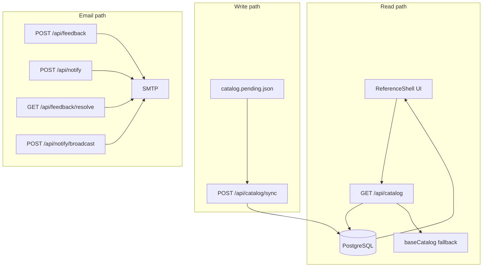

# Documentation index

Start here for focused guides. Each document has **flow diagrams** and step-by-step instructions for one area of the system.

## System overview

| Guide | What it covers |
|-------|----------------|
| [Architecture](flows/01-architecture.md) | Components, data layers, API surface, deployment topology |
| [Site & catalog read](flows/02-site-and-catalog-read.md) | Public pages, UI routes, `GET /api/catalog`, caching |

## Catalog (maintainers)

| Guide | What it covers |
|-------|----------------|
| [Catalog update (incremental)](flows/03-catalog-update.md) | `catalog.pending.json` → validate → sync → production |
| [First deploy & seed](flows/04-catalog-first-deploy.md) | Empty DB, `catalog:seed-db`, verify `sourceFeeds` |
| [Local dev without DB](flows/05-catalog-local-dev.md) | `catalog:merge`, fallback catalog, preview |
| [Catalog setup runbook](CATALOG_SETUP_GUIDE.md) | Full decision tree, JSON shapes, validation checklist |

## Email & subscribers

| Guide | What it covers |
|-------|----------------|
| [Feedback & resolve](flows/06-feedback-and-resolve.md) | Submit request, admin notify, mark resolved, backfill |
| [Subscriber notify](flows/07-subscriber-notify.md) | Sign up, confirm, unsubscribe, resend confirm |
| [Release broadcast](flows/08-release-broadcast.md) | Manual broadcast, auto-broadcast cron, 401 troubleshooting |

## Operations & automation

| Guide | What it covers |
|-------|----------------|
| [CI/CD workflows](flows/09-ci-cd.md) | Catalog Validate, Catalog Deploy, GitHub secrets |
| [Environment & keys](flows/10-environment-and-keys.md) | Env vars, key generation, Vercel ↔ GitHub alignment |
| [Operations handbook](OPERATIONS.md) | API reference, pending JSON examples, deploy notes |

## Security

| Guide | What it covers |
|-------|----------------|
| [Security policy](../SECURITY.md) | How to report issues, in-scope / out-of-scope categories |
| [Security verification](SECURITY_VERIFICATION.md) | Staging replication steps and revalidation checklist |
| [Live security audit (16 tests)](SECURITY_LIVE_TESTS.md) | Step-by-step production test script with expected outputs |

## Other

| Guide | What it covers |
|-------|----------------|
| [User testing notes](USER_TESTING.md) | UX observations and testing suggestions |

## How the pieces connect

