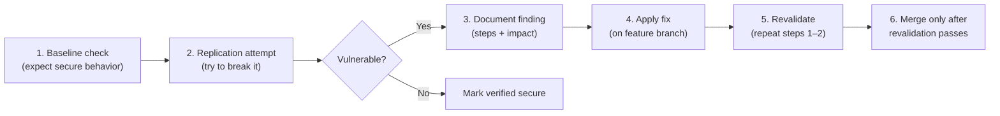

# Security verification guide

Use this guide to **verify in-scope issues on a staging environment** before applying fixes, and to **revalidate after fixes** before merging to `main`.

> **Do not run destructive or high-volume tests against production.** Use a local or preview deployment with test data you control.

## Live site browser testing (important)

Production canonical host: **`https://www.aidevreference.com`**

| Mistake | What happens |
|---------|----------------|
| Open site on `www.aidevreference.com` but fetch `https://aidevreference.com/api/...` | Browser treats this as **cross-origin**; apex returns **308 redirect** to `www`; fetch fails with **CORS blocked** |
| Using wrong domain in Console | `Failed to fetch` / `net::ERR_FAILED 308` — this is **not** an admin-auth failure |

**Do not add CORS headers to admin APIs to “fix” this.** Admin routes should not be callable from arbitrary origins.

### Correct browser Console tests

1. Open **`https://www.aidevreference.com`** (note the `www`)
2. Press **F12 → Console**
3. Use a **relative URL** so the request stays same-origin:

```javascript
fetch("/api/catalog/sync", { method: "POST" })
  .then(async (r) => ({ status: r.status, body: await r.json() }))
  .then(console.log)
```

Expected secure output on production:

```json
{ "status": 401, "body": { "ok": false, "error": "Unauthorized" } }
```

### Alternative: curl (no CORS, works from terminal)

```bash
curl -s -X POST "https://www.aidevreference.com/api/catalog/sync"
# {"ok":false,"error":"Unauthorized"}
```

Always use **`www.aidevreference.com`**, not the apex `aidevreference.com`, when typing full URLs.

## Recommended workflow

For each item below, follow the same cycle:



| Step | Action | Record |
|------|--------|--------|
| **Baseline** | Confirm the control works as designed | Date, environment, result |
| **Replication** | Attempt the attack with minimal impact | Request/response, screenshots |
| **Fix** | Patch on a feature branch (not `main`) | PR link, commit |
| **Revalidation** | Repeat baseline + replication on the fixed branch | Confirm exploit no longer works |

### Staging setup

```bash
cp .env.example .env.local
# Set DATABASE_URL, ADMIN_BROADCAST_KEY, CRON_BROADCAST_KEY, TURNSTILE_*, SMTP_*
npm run dev
```

Use a base URL such as `http://localhost:3000` or a Vercel preview URL:

```bash
export BASE_URL="http://localhost:3000"
export ADMIN_KEY="your-staging-admin-key"
export CRON_KEY="your-staging-cron-key"
```

---

## 1. Authentication and authorization

### 1.1 Admin key required on protected endpoints

**Endpoints:** `POST /api/catalog/sync`, `POST /api/notify/broadcast`, `POST /api/feedback/resolve`, `POST /api/notify/resend-confirm`

**Baseline (secure):** Requests without a valid `x-admin-key` return `401 Unauthorized` when `ADMIN_BROADCAST_KEY` is set and `NODE_ENV=production`.

**Replication:**

```bash
# No key
curl -s -o /dev/null -w "%{http_code}\n" -X POST "$BASE_URL/api/catalog/sync"

# Wrong key
curl -s -o /dev/null -w "%{http_code}\n" -X POST "$BASE_URL/api/catalog/sync" \
  -H "x-admin-key: invalid-key-test"

# Valid key (should succeed or return a business-logic response, not 401)
curl -s -X POST "$BASE_URL/api/catalog/sync" \
  -H "x-admin-key: $ADMIN_KEY"
```

Repeat for broadcast and resolve:

```bash
curl -s -o /dev/null -w "%{http_code}\n" -X POST "$BASE_URL/api/notify/broadcast" \
  -H "Content-Type: application/json" \
  -d '{}'

curl -s -o /dev/null -w "%{http_code}\n" -X POST "$BASE_URL/api/feedback/resolve" \
  -H "Content-Type: application/json" \
  -d '{"token":"test"}'
```

**Vulnerable if:** Any protected action completes without the correct key in production.

**Revalidation:** All three curl blocks above must return `401` without the key and must not perform side effects (no catalog change, no emails sent).

---

### 1.2 Cron key on auto-broadcast

**Endpoint:** `POST /api/notify/auto-broadcast`

**Baseline (secure):** Requires `x-cron-key` or `x-admin-key` matching env vars.

**Replication:**

```bash
curl -s -o /dev/null -w "%{http_code}\n" -X POST "$BASE_URL/api/notify/auto-broadcast"

curl -s -X POST "$BASE_URL/api/notify/auto-broadcast" \
  -H "x-cron-key: $CRON_KEY"
```

**Vulnerable if:** Auto-broadcast runs without either header matching configured keys.

**Revalidation:** Unauthorized call returns `401`; authorized call returns JSON (may be `503` if mail/DB not configured, but not `401`).

---

### 1.3 Dev-only open admin (deployment misconfiguration)

**Baseline (secure):** In production, admin routes never accept requests when `ADMIN_BROADCAST_KEY` is unset.

**Replication:** On a **production-like** preview with `NODE_ENV=production` and **no** `ADMIN_BROADCAST_KEY`:

```bash
curl -s -X POST "$BASE_URL/api/catalog/sync"
```

**Vulnerable if:** Sync or broadcast succeeds without a key in production.

**Revalidation:** Production deployment must always set `ADMIN_BROADCAST_KEY` (and preferably `CRON_BROADCAST_KEY`); unauthenticated calls return `401`.

---

## 2. Token and link security

Tokens are 48-character hex strings (`randomBytes(24)`). Test with **two accounts you own**.

### 2.1 Cross-user token abuse (IDOR)

**Endpoints:**

- `GET /api/notify/confirm?token=…`
- `GET /api/notify/unsubscribe?token=…`
- `GET /api/feedback/resolve?token=…`

**Baseline (secure):** Token A only affects the record created for account A.

**Replication:**

1. Subscribe test email `alice@example.test` → save confirm token from mail or DB.
2. Subscribe test email `bob@example.test` → save confirm/unsubscribe token.
3. Use Alice’s confirm token in Bob’s session context (or Bob’s unsubscribe token against Alice’s row in DB before/after).

```bash
curl -s "$BASE_URL/api/notify/unsubscribe?token=BOB_UNSUBSCRIBE_TOKEN"
# Then verify Alice is still subscribed in DB
```

**Vulnerable if:** One user’s token modifies or reads another user’s subscription or feedback request.

**Revalidation:** Repeat with swapped tokens; only the matching record changes.

---

### 2.2 Invalid or expired tokens rejected

**Replication:**

```bash
curl -s -o /dev/null -w "%{http_code}\n" \
  "$BASE_URL/api/notify/confirm?token=0000000000000000000000000000000000000000000000000000000000000000"

curl -s -o /dev/null -w "%{http_code}\n" \
  "$BASE_URL/api/feedback/resolve?token=not-a-real-token"
```

**Vulnerable if:** Random tokens resolve requests or confirm subscriptions.

**Revalidation:** Invalid tokens return `400` HTML/JSON and do not send emails.

---

### 2.3 Token predictability (manual review)

**Baseline (secure):** Tokens come from `crypto.randomBytes`, not timestamps or sequential IDs.

**Replication:** Review `createToken()` in `src/lib/subscribers.ts` and `src/lib/feedback-requests.ts`. Generate 10 tokens in a test script and confirm high entropy (no pattern).

**Vulnerable if:** Tokens are short, sequential, or derived from email/time.

**Revalidation:** Code still uses `randomBytes` with adequate length (≥24 bytes).

---

## 3. Data exposure

### 3.1 Public API must not leak private records

**Endpoints to inspect:** `GET /api/catalog`, `GET /api/notify/stats`, `GET /api/releases`

**Baseline (secure):**

- `/api/catalog` serves merged catalog only (not `catalog.pending.json`).
- `/api/notify/stats` returns aggregate counts, not email addresses.
- No endpoint returns `DATABASE_URL`, SMTP passwords, or admin keys.

**Replication:**

```bash
curl -s "$BASE_URL/api/catalog" | head -c 500
curl -s "$BASE_URL/api/notify/stats"
curl -s "$BASE_URL/api/releases"
```

Search responses for `@`, `postgresql://`, `ADMIN_BROADCAST_KEY`, or subscriber message bodies.

**Vulnerable if:** PII, secrets, or draft pending catalog appear in public JSON.

**Revalidation:** Same curls; confirm only intended public fields remain.

---

### 3.2 Production error messages

**Baseline (secure):** Production errors are generic (no stack traces or SQL details).

**Replication:** Send malformed JSON to a form endpoint:

```bash
curl -s -X POST "$BASE_URL/api/feedback" \
  -H "Content-Type: application/json" \
  -d '{broken json'
```

**Vulnerable if:** Response includes stack traces, query text, or env values.

**Revalidation:** Production returns generic `"Unable to submit request."` or validation errors only.

---

### 3.3 Admin email links contain resolve tokens

**Baseline (secure):** Resolve links work only for the matching feedback row; links are sent only to `MAIL_TO`.

**Replication:** Submit legitimate feedback on staging; inspect admin email for resolve URL; confirm URL is not guessable from request id alone.

**Revalidation:** Resolve link still works for admin workflow; token not exposed in public API.

---

## 4. Input handling and injection

### 4.1 SQL injection on form fields

**Baseline (secure):** Parameterized queries via the `postgres` tagged template; suspicious patterns blocked by `hasSuspiciousInput`.

**Replication:** Submit feedback with payloads in `name`, `email`, and `message`:

```bash
curl -s -X POST "$BASE_URL/api/feedback" \
  -H "Content-Type: application/json" \
  -d '{
    "name": "Test",
    "email": "test@example.com",
    "tool": "General",
    "type": "I want to contact",
    "message": "hello UNION SELECT email FROM subscribers--",
    "acceptPolicies": true,
    "formStartedAt": '"$(($(date +%s%3N)-5000))"'
  }'
```

Also try: `'; DROP TABLE subscribers;--`, `1 OR 1=1`, etc.

**Vulnerable if:** Request succeeds with unexpected DB errors, extra data in response, or table damage.

**Revalidation:** Payloads rejected with `400` / “Suspicious input” or stored safely without query manipulation.

---

### 4.2 Stored / reflected XSS

**Baseline (secure):** User content escaped on HTML pages (`escapeHtml` on resolve page); email templates sanitize input.

**Replication:**

1. Submit feedback with message: ``.
2. Open the admin resolve link (`GET /api/feedback/resolve?token=…`).
3. View page source — script must not execute.

**Vulnerable if:** Browser runs attacker script on resolve or feedback-related pages.

**Revalidation:** HTML entities escaped in `<h1>`, `<p>`, and summary blocks.

---

### 4.3 HTML / email injection

**Replication:** Submit notify/feedback with subject-breaking newlines or HTML in the name field:

```
Name: Attacker\r\nBcc: evil@example.com
Message: <a href="https://evil.example">Click</a>
```

**Vulnerable if:** Email headers break or phishing HTML renders as active content without sanitization.

**Revalidation:** Emails show escaped or plain text only.

---

## 5. Abuse prevention bypass

Test on staging with **low volume** (do not flood production SMTP).

### 5.1 Rate limiting

**Baseline (secure):** More than 12 POSTs per IP per 10 minutes → `429 Too many requests`.

**Replication:** Loop 13 feedback POSTs (with valid captcha on staging, or dev without Turnstile):

```bash
for i in $(seq 1 13); do
  curl -s -o /dev/null -w "$i:%{http_code}\n" -X POST "$BASE_URL/api/feedback" \
    -H "Content-Type: application/json" \
    -d "{\"name\":\"Rate Test\",\"email\":\"rate$i@example.test\",\"tool\":\"General\",\"type\":\"Other\",\"message\":\"Testing rate limit number $i\",\"acceptPolicies\":true,\"formStartedAt\":$(($(date +%s%3N)-5000))}"
done
```

**Vulnerable if:** All 13 succeed with `200`/`ok:true` and emails send every time.

**Revalidation:** Request 13 returns `429`.

---

### 5.2 Honeypot field (`website`)

**Replication:**

```bash
curl -s -X POST "$BASE_URL/api/notify" \
  -H "Content-Type: application/json" \
  -d '{
    "email": "bot@example.test",
    "acceptPolicies": true,
    "website": "http://spam.example",
    "formStartedAt": '"$(($(date +%s%3N)-5000))"'
  }'
```

**Vulnerable if:** Subscription is created or confirmation email sent.

**Revalidation:** Response contains spam detection error; no new subscriber row.

---

### 5.3 Fast-form bot check

**Replication:** Set `formStartedAt` to current time (submission in &lt; 1.5s):

```bash
curl -s -X POST "$BASE_URL/api/feedback" \
  -H "Content-Type: application/json" \
  -d "{
    \"name\": \"Fast Bot\",
    \"email\": \"fast@example.test\",
    \"tool\": \"General\",
    \"type\": \"Other\",
    \"message\": \"Submitted too quickly for human\",
    \"acceptPolicies\": true,
    \"formStartedAt\": $(date +%s%3N)
  }"
```

**Vulnerable if:** Request accepted when Turnstile is skipped (dev) without anti-bot block.

**Revalidation:** `"Spam detection triggered"` when captcha is skipped and form is too fast.

---

### 5.4 Turnstile required in production

**Baseline (secure):** With `TURNSTILE_SECRET_KEY` set and `NODE_ENV=production`, missing captcha fails.

**Replication on production-like env:**

```bash
curl -s -X POST "$BASE_URL/api/notify" \
  -H "Content-Type: application/json" \
  -d '{"email":"test@example.com","acceptPolicies":true,"formStartedAt":'"$(($(date +%s%3N)-5000))"'}'
```

**Vulnerable if:** `ok: true` without valid `captchaToken`.

**Revalidation:** `"CAPTCHA verification failed"` without token.

---

### 5.5 Unauthorized broadcast / email flood

**Replication:** Without admin key, attempt broadcast (see §1.1). With admin key on staging only, send one broadcast and confirm recipient list is confirmed subscribers only.

**Vulnerable if:** Unauthenticated caller triggers mass email.

**Revalidation:** Broadcast requires admin key; rate limits and captcha still protect signup forms.

---

## 6. Server-side request and execution risks

### 6.1 SSRF

**Current surface:** The app fetches Cloudflare Turnstile (`challenges.cloudflare.com`) server-side only. User input does not control outbound fetch URLs.

**Replication:** Search codebase for `fetch(` with user-controlled URLs. If new features accept URLs, test with internal targets (`http://127.0.0.1`, `http://169.254.169.254`).

**Vulnerable if:** Attacker-controlled URL is fetched by the server.

**Revalidation:** No user-controlled server-side fetches, or strict allowlist enforced.

---

### 6.2 Remote code execution

**Replication:** Review usage of `eval`, `child_process`, `sql.unsafe` with user input, and dynamic `require`. Attempt template injection in any new admin-only template paths.

**Vulnerable if:** User input reaches shell/SQL unsafe/VM execution.

**Revalidation:** Code review confirms parameterized queries and no dynamic execution of user strings.

---

## 7. Infrastructure and deployment

### 7.1 Secrets in repository and client bundle

**Replication:**

```bash
rg -i "ADMIN_BROADCAST_KEY|SMTP_PASS|DATABASE_URL" --glob '!*.example' --glob '!.env*'
grep -r "NEXT_PUBLIC_.*KEY" src/
```

**Vulnerable if:** Real secrets committed or exposed via `NEXT_PUBLIC_*` vars.

**Revalidation:** Only placeholders in repo; secrets in Vercel/GitHub env only.

---

### 7.2 GitHub ↔ Vercel key alignment

**Replication:** Trigger auto-broadcast workflow with wrong `CRON_BROADCAST_KEY` in GitHub vs Vercel (see [Release broadcast — 401](flows/08-release-broadcast.md)).

**Vulnerable if:** Cron runs with wrong key (401) **or** runs with no key when it should not.

**Revalidation:** Documented keys match; cron succeeds with correct header only.

---

## Master checklist

Copy this table when running a full audit. Mark each row after baseline + replication on staging, then again after fixes.

| ID | Area | Baseline OK | Exploit attempted | Finding | Fix PR | Revalidated |
|----|------|-------------|-------------------|---------|--------|-------------|
| 1.1 | Admin key on protected POST routes | ☐ | ☐ | | | ☐ |
| 1.2 | Cron key on auto-broadcast | ☐ | ☐ | | | ☐ |
| 1.3 | No open admin in production | ☐ | ☐ | | | ☐ |
| 2.1 | Token IDOR | ☐ | ☐ | | | ☐ |
| 2.2 | Invalid tokens rejected | ☐ | ☐ | | | ☐ |
| 2.3 | Token entropy | ☐ | ☐ | | | ☐ |
| 3.1 | Public API data leakage | ☐ | ☐ | | | ☐ |
| 3.2 | Safe production errors | ☐ | ☐ | | | ☐ |
| 3.3 | Resolve links scoped correctly | ☐ | ☐ | | | ☐ |
| 4.1 | SQL injection | ☐ | ☐ | | | ☐ |
| 4.2 | XSS on resolve/UI | ☐ | ☐ | | | ☐ |
| 4.3 | Email injection | ☐ | ☐ | | | ☐ |
| 5.1 | Rate limit | ☐ | ☐ | | | ☐ |
| 5.2 | Honeypot | ☐ | ☐ | | | ☐ |
| 5.3 | Fast-form bot block | ☐ | ☐ | | | ☐ |
| 5.4 | Turnstile in production | ☐ | ☐ | | | ☐ |
| 5.5 | Broadcast auth | ☐ | ☐ | | | ☐ |
| 6.1 | SSRF | ☐ | ☐ | | | ☐ |
| 6.2 | RCE paths | ☐ | ☐ | | | ☐ |
| 7.1 | Secrets not in repo/client | ☐ | ☐ | | | ☐ |
| 7.2 | Cron/admin key alignment | ☐ | ☐ | | | ☐ |

---

## Related

- [Security policy](../SECURITY.md)
- [Environment & keys](flows/10-environment-and-keys.md)
- [Operations handbook](OPERATIONS.md)
