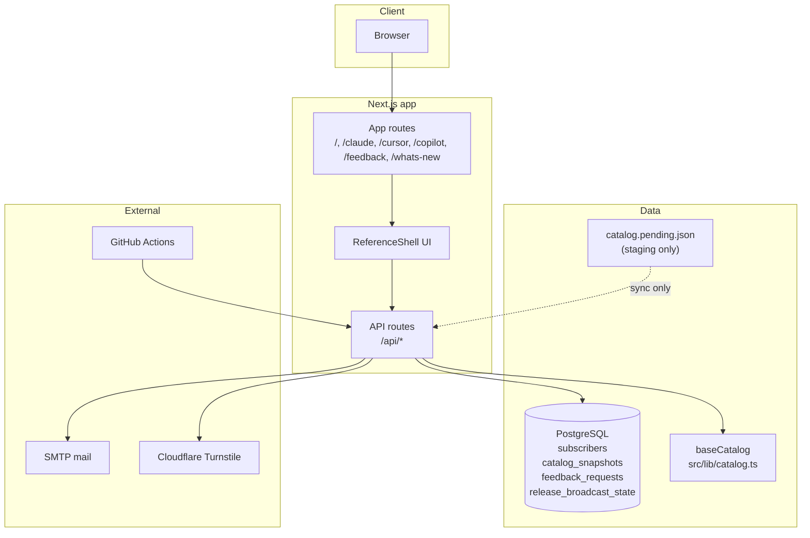
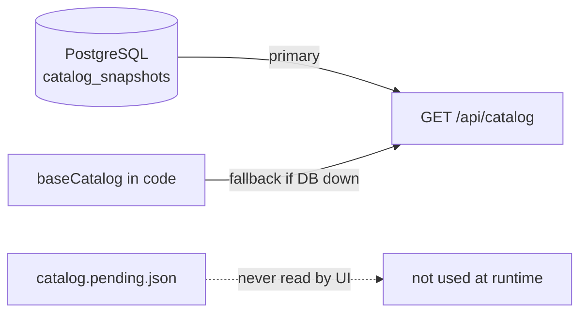

# Architecture

High-level system design for AI Dev Reference.

## Component diagram



## Data priority (catalog)



| Layer | Read by live site? | Purpose |
|-------|-------------------|---------|
| PostgreSQL snapshot | **Yes** (primary) | Production catalog |
| `baseCatalog` in code | Only if DB unavailable | Seed source + fallback |
| `catalog.pending.json` | **No** | Draft queue before sync |

Check `sourceFeeds` in `/api/catalog` response:

| Value | Meaning |
|-------|---------|
| `["database-snapshot"]` | Live data from PostgreSQL |
| `["json-seed-cache"]` | DB unavailable — code fallback |

## Project layout

```
src/
  app/              Routes and API endpoints
  features/         ReferenceShell UI, forms
  lib/              Catalog, subscribers, mail, validation
  emails/           HTML email templates
data/
  catalog.pending.json   Staging queue (not served directly)
scripts/            catalog:validate, merge, seed-db, reset-pending
db/                 SQL bootstrap files
docs/flows/         Per-feature flow guides (this folder)
```

## API surface (summary)

| Area | Endpoints |
|------|-----------|
| Catalog | `GET /api/catalog`, `POST /api/catalog/sync` |
| Feedback | `POST /api/feedback`, `GET/POST /api/feedback/resolve` |
| Notify | `POST /api/notify`, `GET /api/notify/confirm`, `GET /api/notify/unsubscribe`, `POST /api/notify/resend-confirm` |
| Broadcast | `POST /api/notify/broadcast`, `POST /api/notify/auto-broadcast` |
| Releases | `GET /api/releases` |

Details: [Operations handbook](../OPERATIONS.md)

## Related guides

- [Site & catalog read](02-site-and-catalog-read.md)
- [Environment & keys](10-environment-and-keys.md)
- [CI/CD workflows](09-ci-cd.md)
