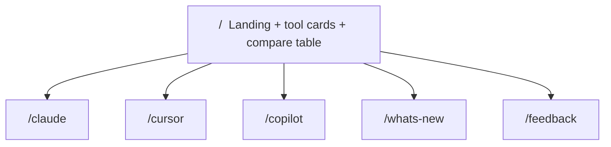
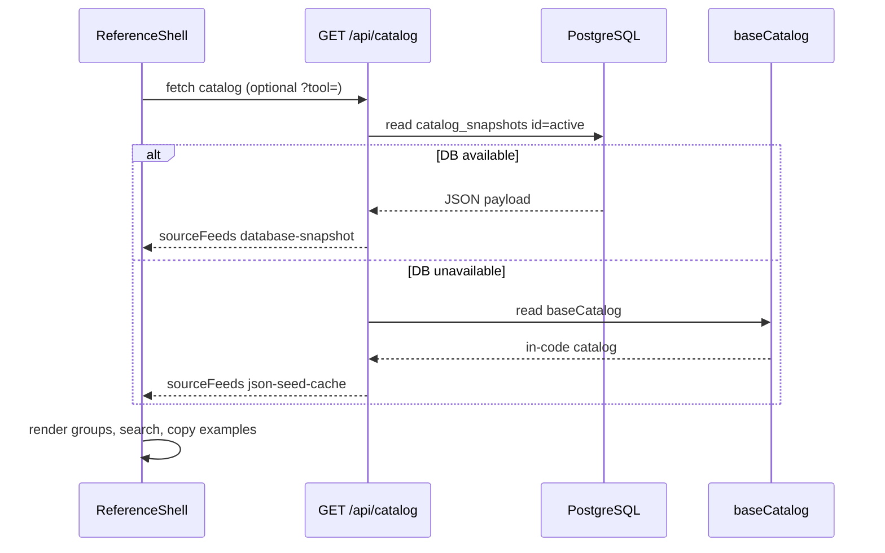

# Site & catalog read flow

How visitors browse the reference and how the UI loads catalog data.

## Public site map



| Route | Content |
|-------|---------|
| `/` | Tool cards, entry counts, side-by-side comparison table |
| `/claude` | Claude commands, skills, agents, hooks |
| `/cursor` | Cursor commands, skills, agents, hooks |
| `/copilot` | Copilot commands, skills, agents, hooks |
| `/whats-new` | Recently added catalog entries |
| `/feedback` | Submit a request + release notification signup |

## Catalog read flow (runtime)



## Tool-scoped fetch

For efficiency, tool pages can request a single tool:

```text
GET /api/catalog?tool=claude
GET /api/catalog?tool=cursor
GET /api/catalog?tool=copilot
```

## Landing comparison table

The table at the bottom of `/` is **intentional** — a side-by-side tool comparison (not a diff or error).

| Row | Shows |
|-----|-------|
| Catalog entries | Live counts per tool |
| Slash commands | Command count per tool |
| Skills / agents / hooks | Meta breakdown |
| Configure in | Config file paths per vendor |
| Parallel execution, MCP, etc. | Product capability comparison |

Command counts differ per vendor by design.

## Related guides

- [Architecture](01-architecture.md)
- [Catalog update](03-catalog-update.md)
- [User testing notes](../USER_TESTING.md)
