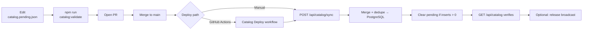

# Catalog update flow (incremental)

Add **new** commands after the site is already live.

## When to use this flow

| Use this | Not this |
|----------|----------|
| Adding 1–N new entries | First deploy → [First deploy & seed](04-catalog-first-deploy.md) |
| `POST /api/catalog/sync` | `catalog:seed-db` (full overwrite) |
| Editing `catalog.pending.json` | Editing only `baseCatalog` for production |

## Flow diagram



## Step-by-step

### 1. Add entries to pending

Edit `data/catalog.pending.json` with **only new** records. See [Operations handbook](../OPERATIONS.md) for JSON shapes.

### 2. Validate locally

```bash
npm run catalog:validate
```

### 3. Sync to production

**Option A — GitHub Actions** (after secrets are configured):

Merge PR → **Catalog Deploy** runs automatically.

**Option B — Manual API:**

```bash
curl -X POST "https://your-domain.com/api/catalog/sync" \
  -H "x-admin-key: $ADMIN_BROADCAST_KEY"
```

PowerShell:

```powershell
Invoke-RestMethod -Method Post `
  -Uri "https://your-domain.com/api/catalog/sync" `
  -Headers @{ "x-admin-key" = "<ADMIN_BROADCAST_KEY>" }
```

### 4. Verify

```bash
curl https://your-domain.com/api/catalog
```

Confirm `"sourceFeeds": ["database-snapshot"]` and new entries appear.

### 5. Notify subscribers (optional)

See [Release broadcast](08-release-broadcast.md).

## Dedup keys (duplicates skipped silently)

| Type | Identity key |
|------|--------------|
| Commands | `cmd\|name` |
| Skills / Hooks | `cmd\|name` |
| Agents | `name` |

## Stale pending file

If pending is full but DB already has the data:

```bash
npm run catalog:reset-pending
```

## Related guides

- [Catalog setup runbook](../CATALOG_SETUP_GUIDE.md)
- [CI/CD workflows](09-ci-cd.md)
- [First deploy & seed](04-catalog-first-deploy.md)
