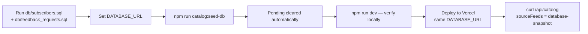
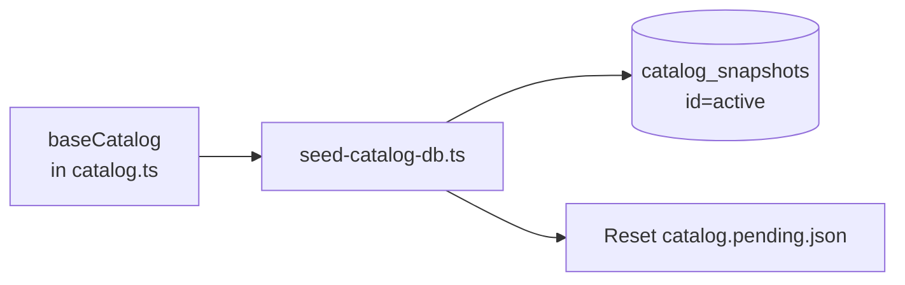

# First deploy & seed flow

Bootstrap production when the database is empty and `baseCatalog` already has data.

## When to use

- New project / first Vercel deploy
- Empty `catalog_snapshots` table
- Full refresh from code to DB

Do **not** use `POST /api/catalog/sync` alone if pending is empty — use seed instead.

## Flow diagram



## Commands

```bash
# 1. Bootstrap DB schema (once, in Neon SQL editor)
#    Run db/subscribers.sql and db/feedback_requests.sql

# 2. Local seed
npm install
cp .env.example .env.local   # set DATABASE_URL
npm run catalog:seed-db

# 3. Verify locally
npm run dev
# Open http://localhost:3000 — check /api/catalog sourceFeeds

# 4. Deploy
# Set DATABASE_URL + NEXT_PUBLIC_SITE_URL on Vercel, then deploy
```

## What `catalog:seed-db` does



| Action | Result |
|--------|--------|
| Writes full catalog to DB | Production snapshot created/updated |
| Clears pending | Repo draft file emptied (unless `--keep-pending`) |

## After deploy checklist

- [ ] `GET /api/catalog` returns `database-snapshot`
- [ ] Tool pages show expected entry counts
- [ ] SMTP and Turnstile env vars set if using forms/email
- [ ] GitHub Actions secrets configured → [CI/CD](09-ci-cd.md)

## Related guides

- [Catalog update (incremental)](03-catalog-update.md)
- [Environment & keys](10-environment-and-keys.md)
- [Architecture](01-architecture.md)
