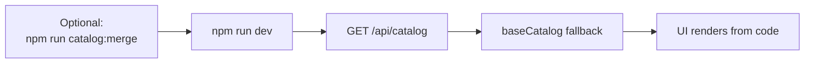

# Local development without database

Preview the site when PostgreSQL is not configured.

## Flow diagram



## Commands

```bash
npm install
cp .env.example .env.local   # DATABASE_URL optional
npm run catalog:merge          # optional: merge pending into baseCatalog
npm run dev
```

Open [http://localhost:3000](http://localhost:3000).

## What happens

| Config | Catalog source |
|--------|----------------|
| No `DATABASE_URL` | `baseCatalog` in `src/lib/catalog.ts` |
| `DATABASE_URL` set | PostgreSQL if reachable, else fallback |

Response shows `"sourceFeeds": ["json-seed-cache"]` when using code fallback.

## Scripts comparison

| Command | Needs DB? | Purpose |
|---------|-----------|---------|
| `catalog:validate` | No | Check pending JSON before PR |
| `catalog:merge` | No | Merge pending → `baseCatalog` in code |
| `catalog:seed-db` | **Yes** | Push code catalog → PostgreSQL |
| `catalog:reset-pending` | No | Empty pending file |

## Related guides

- [First deploy & seed](04-catalog-first-deploy.md)
- [Catalog setup runbook](../CATALOG_SETUP_GUIDE.md)
