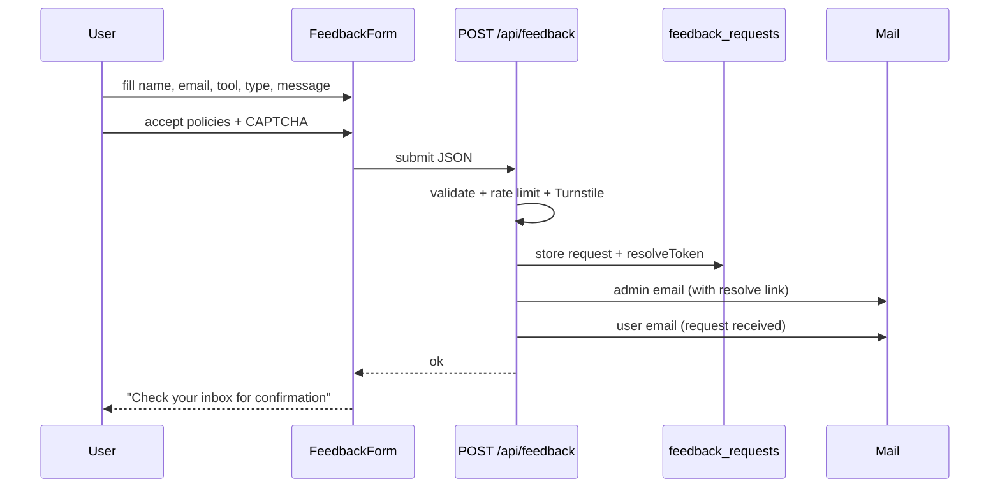
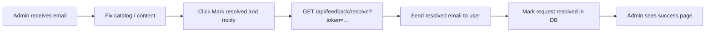
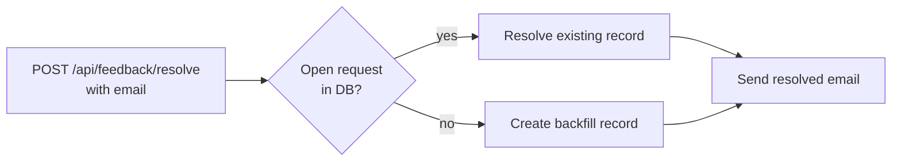

# Feedback & resolve flow

Submit support requests, notify the admin, and mark requests resolved.

## Submit request flow



## Admin resolve flow (after fix)



## Resolve email to user

Subject: **Request resolved · {tool}**

Includes:

- Request type and tool
- Optional resolution note
- Link back to the site

## Backfill (requests before deploy)

Older submissions have no resolve token in the admin inbox. After deploy, notify by email:

```bash
curl -X POST "https://your-domain.com/api/feedback/resolve" \
  -H "content-type: application/json" \
  -H "x-admin-key: $ADMIN_BROADCAST_KEY" \
  -d '{
    "email": "requester@example.com",
    "name": "Nuthan",
    "tool": "Cursor",
    "type": "Missing command",
    "note": "Added the missing command to the catalog."
  }'
```

PowerShell:

```powershell
Invoke-RestMethod -Method Post `
  -Uri "https://your-domain.com/api/feedback/resolve" `
  -Headers @{ "x-admin-key" = "<ADMIN_BROADCAST_KEY>"; "content-type" = "application/json" } `
  -Body '{"email":"requester@example.com","name":"Nuthan","tool":"Cursor","type":"Missing command","note":"Your request has been addressed."}'
```



## Optional resolution note (GET link)

```text
/api/feedback/resolve?token=<token>&note=Added%20missing%20command
```

## API reference

| Method | Endpoint | Auth | Purpose |
|--------|----------|------|---------|
| `POST` | `/api/feedback` | Turnstile | Submit request |
| `GET` | `/api/feedback/resolve?token=` | Token in URL | One-click resolve from admin email |
| `POST` | `/api/feedback/resolve` | `x-admin-key` | Resolve by token or email backfill |

## Related guides

- [Subscriber notify](07-subscriber-notify.md)
- [Release broadcast](08-release-broadcast.md)
- [Environment & keys](10-environment-and-keys.md)
