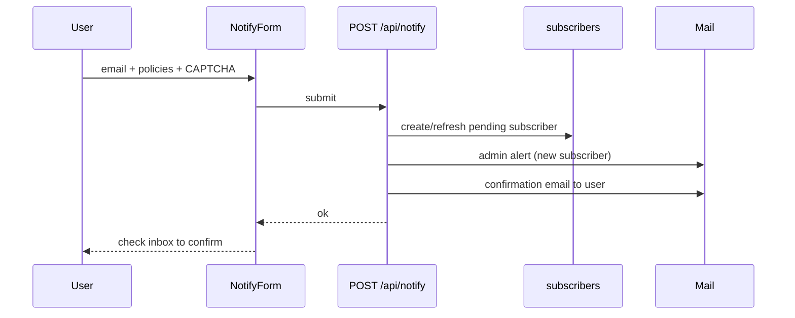
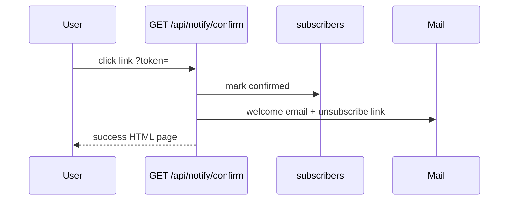
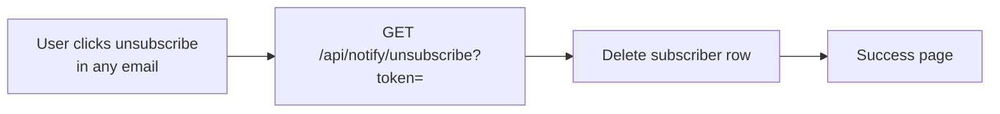
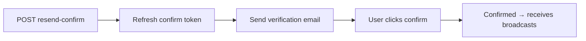
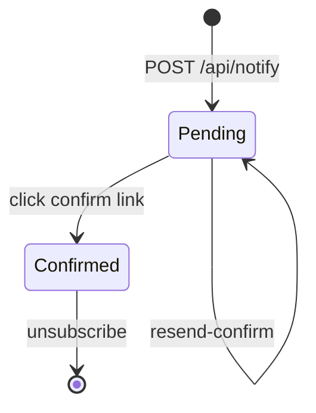

# Subscriber notify flow

Email signup, confirmation, and unsubscribe for release notifications.

## Signup flow



## Confirmation flow



Token expires after **48 hours**. User can re-submit on `/feedback` to get a new link.

## Unsubscribe flow



## Resend confirm (backfill)

For subscribers who signed up before deploy or never confirmed:

**One email:**

```bash
curl -X POST "https://your-domain.com/api/notify/resend-confirm" \
  -H "content-type: application/json" \
  -H "x-admin-key: $ADMIN_BROADCAST_KEY" \
  -d '{"email":"subscriber@example.com"}'
```

**All pending subscribers:**

```bash
curl -X POST "https://your-domain.com/api/notify/resend-confirm" \
  -H "content-type: application/json" \
  -H "x-admin-key: $ADMIN_BROADCAST_KEY" \
  -d '{"allPending":true}'
```



## Subscriber states



| State | Receives release broadcasts? |
|-------|------------------------------|
| Pending | **No** — must confirm first |
| Confirmed | **Yes** |

## API reference

| Method | Endpoint | Auth | Purpose |
|--------|----------|------|---------|
| `POST` | `/api/notify` | Turnstile | Start subscription |
| `GET` | `/api/notify/confirm?token=` | Token | Confirm subscription |
| `GET` | `/api/notify/unsubscribe?token=` | Token | Unsubscribe |
| `POST` | `/api/notify/resend-confirm` | `x-admin-key` | Resend confirmation |
| `GET` | `/api/notify/stats` | None | Subscriber counts |

## Related guides

- [Feedback & resolve](06-feedback-and-resolve.md)
- [Release broadcast](08-release-broadcast.md)
