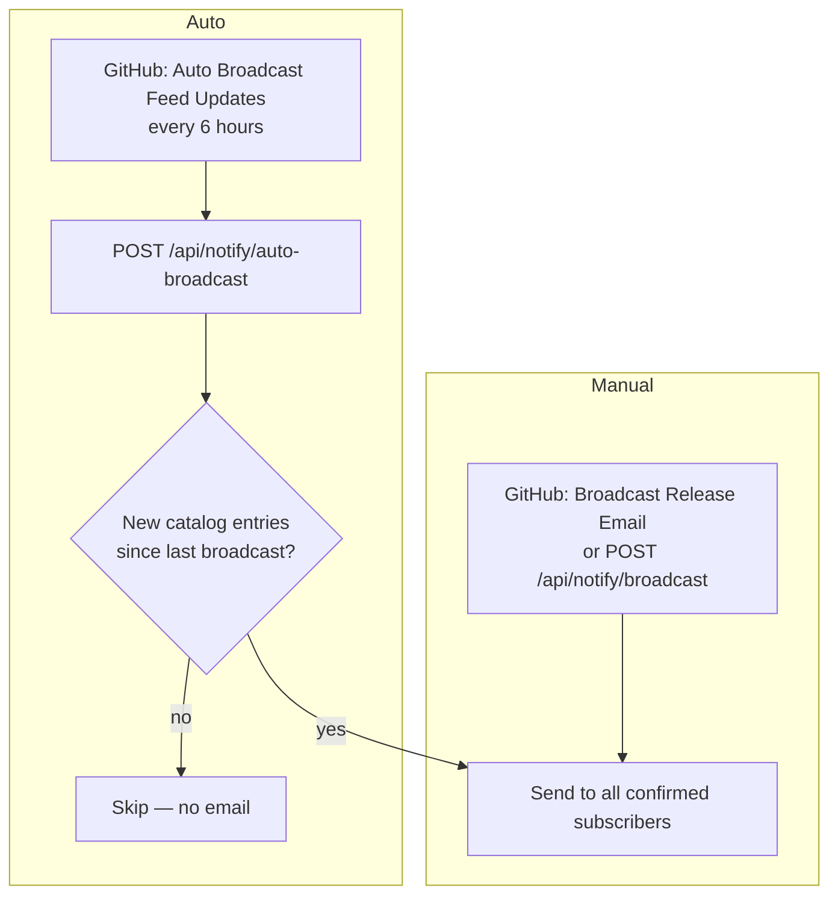
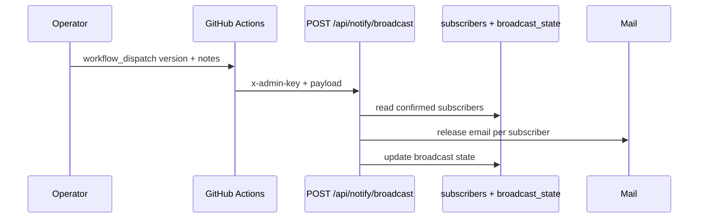
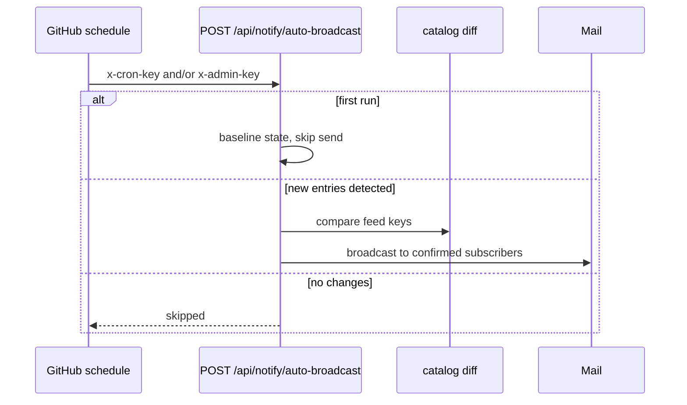
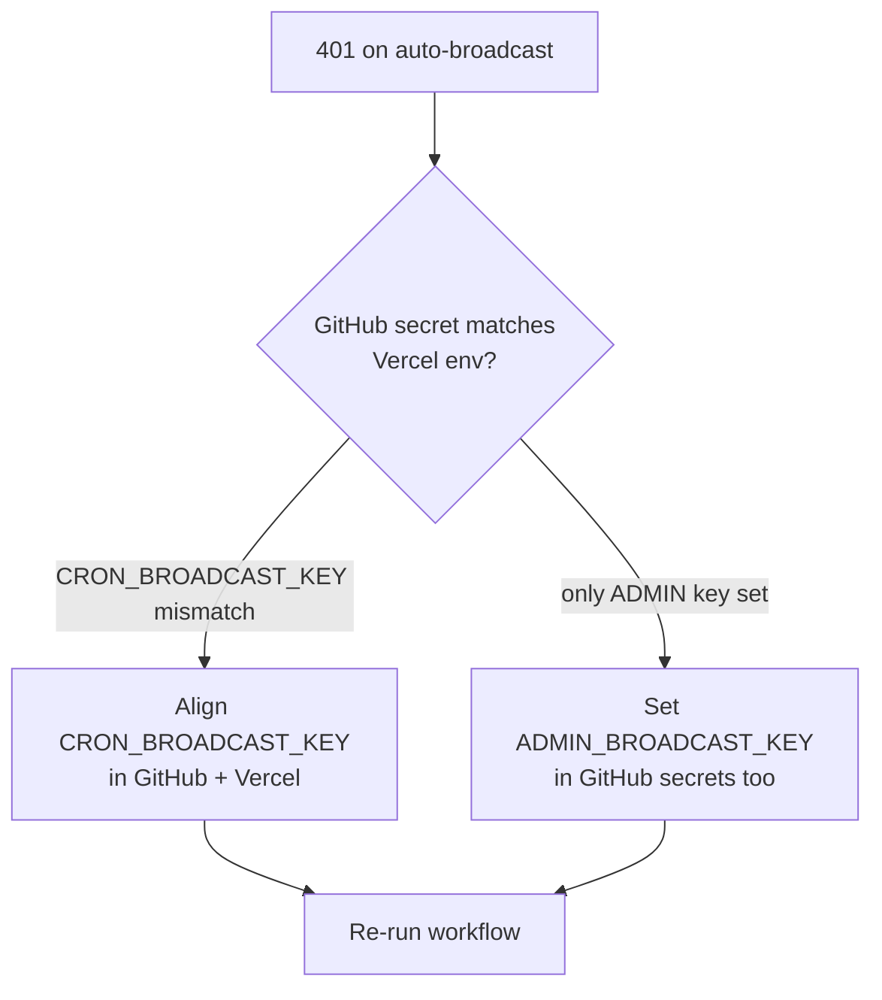

# Release broadcast flow

Email confirmed subscribers when the catalog changes.

## Two broadcast modes



## Manual broadcast flow



**Or curl directly:**

```bash
curl -X POST "https://your-domain.com/api/notify/broadcast" \
  -H "content-type: application/json" \
  -H "x-admin-key: $ADMIN_BROADCAST_KEY" \
  -d '{"version":"2026.07.03","notes":["Added /trace command to Claude"]}'
```

If `notes` omitted, API builds notes from catalog diff.

## Auto-broadcast flow



## Fixing HTTP 401 Unauthorized

If auto-broadcast fails with `{"ok":false,"error":"Unauthorized"}`:



The endpoint accepts **either**:

| Header | Env var |
|--------|---------|
| `x-cron-key` | `CRON_BROADCAST_KEY` |
| `x-admin-key` | `ADMIN_BROADCAST_KEY` |

GitHub workflow sends both when secrets exist.

## GitHub secrets

| Secret | Example |
|--------|---------|
| `AUTO_BROADCAST_ENDPOINT_URL` | `https://your-domain.com/api/notify/auto-broadcast` |
| `CRON_BROADCAST_KEY` | Same as Vercel |
| `ADMIN_BROADCAST_KEY` | Same as Vercel (fallback) |
| `BROADCAST_ENDPOINT_URL` | `https://your-domain.com/api/notify/broadcast` |

## Typical operator sequence

1. Merge catalog changes → [Catalog update](03-catalog-update.md)
2. Verify live site shows new entries
3. Run **Broadcast Release Email** workflow **or** wait for auto-broadcast (6h cron)
4. For individual requesters → [Feedback resolve](06-feedback-and-resolve.md) (not the same as broadcast)

## Related guides

- [CI/CD workflows](09-ci-cd.md)
- [Environment & keys](10-environment-and-keys.md)
- [Subscriber notify](07-subscriber-notify.md)
