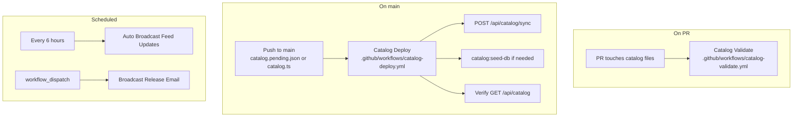
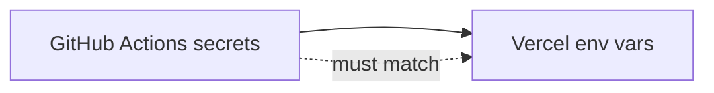

# CI/CD workflows

GitHub Actions automation for catalog validation, deploy, and broadcasts.

## Workflow overview

## Catalog Validate

| | |
|--|--|
| **Trigger** | PR changing `data/catalog.pending.json` or `src/lib/catalog.ts` |
| **Purpose** | JSON validation, required fields, duplicate detection |
| **Action** | Block merge if invalid |

## Catalog Deploy

| | |
|--|--|
| **Trigger** | Push to `main` or manual dispatch |
| **Purpose** | Sync pending → production DB, optional seed, verify site |
| **Manual** | Actions → Catalog Deploy → Run workflow → `auto`, `sync`, or `seed` |

## Auto Broadcast Feed Updates

| | |
|--|--|
| **Trigger** | Cron `0 */6 * * *` or manual |
| **Purpose** | Email subscribers when new catalog entries detected |
| **Auth** | `x-cron-key` and/or `x-admin-key` |

See [Release broadcast — 401 fix](08-release-broadcast.md#fixing-http-401-unauthorized).

## Broadcast Release Email

| | |
|--|--|
| **Trigger** | Manual only (`workflow_dispatch`) |
| **Inputs** | `version`, optional `notes` (one per line) |
| **Auth** | `x-admin-key` |

## One-time GitHub secrets

| Secret | Used by | Must match Vercel |
|--------|---------|-------------------|
| `DATABASE_URL` | Catalog Deploy seed | `DATABASE_URL` |
| `SYNC_ENDPOINT_URL` | Catalog Deploy | — |
| `ADMIN_BROADCAST_KEY` | Sync, broadcast, resolve | `ADMIN_BROADCAST_KEY` |
| `SITE_URL` | Post-deploy check | `NEXT_PUBLIC_SITE_URL` |
| `AUTO_BROADCAST_ENDPOINT_URL` | Auto broadcast | — |
| `CRON_BROADCAST_KEY` | Auto broadcast | `CRON_BROADCAST_KEY` |
| `BROADCAST_ENDPOINT_URL` | Manual broadcast | — |

## Related guides

- [Catalog update](03-catalog-update.md)
- [First deploy & seed](04-catalog-first-deploy.md)
- [Release broadcast](08-release-broadcast.md)
- [Operations handbook](../OPERATIONS.md)
