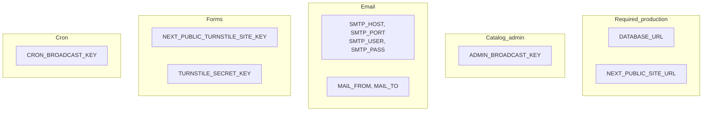
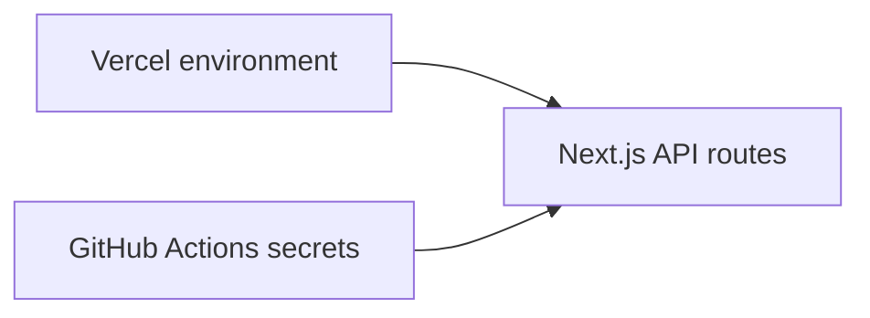

# Environment & keys

Configuration for local development and production (Vercel + GitHub).

## Variable groups



## Quick reference

| Variable | Required for | Purpose |
|----------|--------------|---------|
| `DATABASE_URL` | Production catalog + subscribers | PostgreSQL connection |
| `NEXT_PUBLIC_SITE_URL` | Production | SEO, email links, sitemap |
| `ADMIN_BROADCAST_KEY` | Sync, broadcast, resolve APIs | `x-admin-key` auth |
| `CRON_BROADCAST_KEY` | Auto-broadcast cron | `x-cron-key` auth |
| `SMTP_*`, `MAIL_*` | Email features | Feedback + notify + broadcast |
| `TURNSTILE_*` | Public forms | Anti-abuse CAPTCHA |

Full template: [.env.example](../../.env.example)

## Generate secure keys

PowerShell:

```powershell
[Convert]::ToBase64String((1..48 | ForEach-Object { Get-Random -Maximum 256 }))
```

OpenSSL:

```bash
openssl rand -base64 48
```

Node:

```bash
node -e "console.log(require('crypto').randomBytes(48).toString('base64'))"
```

## Vercel ↔ GitHub alignment



**Rule:** Values used in GitHub workflows must be **identical** to Vercel for the same key name.

Common 401 cause: `CRON_BROADCAST_KEY` in GitHub ≠ Vercel.

**Simpler setup:** Use one key everywhere:

1. Generate one random value
2. Set `ADMIN_BROADCAST_KEY` in Vercel and GitHub
3. Optionally set `CRON_BROADCAST_KEY` to the **same** value

Auto-broadcast accepts either header.

## Local development minimum

| Goal | Minimum env |
|------|-------------|
| Browse catalog only | None (uses `baseCatalog`) |
| Forms + email locally | SMTP + Turnstile |
| Seed / sync locally | `DATABASE_URL` + `ADMIN_BROADCAST_KEY` |

## Related guides

- [First deploy & seed](04-catalog-first-deploy.md)
- [CI/CD workflows](09-ci-cd.md)
- [Release broadcast — 401](08-release-broadcast.md#fixing-http-401-unauthorized)
